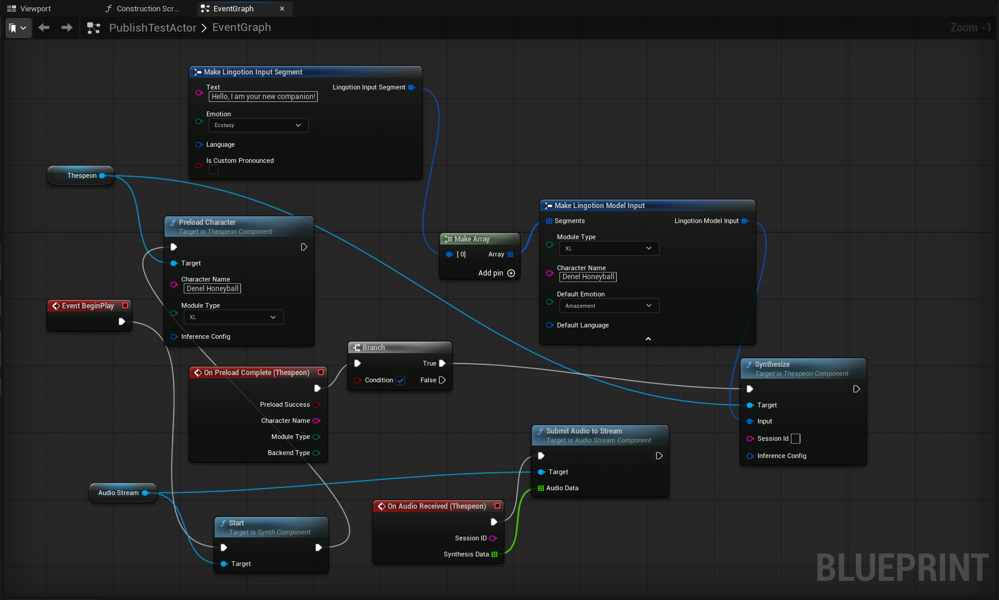

# Get Started - Unreal

## Table of Contents
- [Get Started - Unreal](#get-started---unreal)
  - [Table of Contents](#table-of-contents)
  - [Overview](#overview)
  - [Install the Thespeon Unreal Plugin](#install-the-thespeon-unreal-plugin)
  - [Add the developer license key](#add-the-developer-license-key)
  - [Import the downloaded _.lingotion_ file](#import-the-downloaded-lingotion-file)
  - [Run the _GUISample_ level](#run-the-guisample-level)
  - [Your first synthesis in Blueprint](#your-first-synthesis-in-blueprint)
    - [Create a new Actor Blueprint](#create-a-new-actor-blueprint)
    - [Add the Thespeon Component](#add-the-thespeon-component)
    - [Preload the character](#preload-the-character)
    - [Bind the OnPreloadComplete event](#bind-the-onpreloadcomplete-event)
    - [Synthesize speech](#synthesize-speech)
    - [Audio playback](#audio-playback)
    - [Reference Blueprint](#reference-blueprint)
    - [Place and test](#place-and-test)
    - [Complete Blueprint flow summary](#complete-blueprint-flow-summary)
  - [Your first synthesis in C++](#your-first-synthesis-in-c)
    - [Create an Actor with a ThespeonComponent](#create-an-actor-with-a-thespeoncomponent)
    - [Implement preload and synthesis](#implement-preload-and-synthesis)
    - [Key functions reference](#key-functions-reference)
    - [Key delegates](#key-delegates)
    - [Key types](#key-types)
  - [Next steps](#next-steps)

---

## Overview
This document details a step-by-step guide on how to install Lingotion Thespeon in your Unreal project, set up your first synthesis, and start generating character voices. This process covers:
1. Install the Thespeon Plugin
2. Add the developer license key
3. Import the downloaded _.lingotion_ files
4. Run the _GUISample_ level to verify setup
5. Integrate Thespeon into your own project (Blueprint or C++)

> [!TIP]
> If you have not downloaded any _.lingotion_ files, please follow the [Get Started - Webportal](https://github.com/Lingotion/.github/blob/main/profile/portal-docs/get-started-webportal.md) guide before proceeding.

## Install the Thespeon Unreal Plugin
> [!IMPORTANT]
> The Lingotion Thespeon Plugin only works in C++ projects. If your project is created as a Blueprint project, follow the instructions at [Unreal Engine C++ Required Setup](https://dev.epicgames.com/documentation/en-us/unreal-engine/unreal-engine-cpp-quick-start#1requiredsetup) before continuing.
> 
1. Clone the repository into the **Plugins** folder of your project, or download your desired release and extract it into the **Plugins** folder. If the folder does not exist, create it.

2. Regenerate the Visual Studio Solution files using the Tools menu, and recompile your project.

If the following popup occurs, press **Yes**:


3. When starting the project, verify that the **Lingotion Thespeon** plugin is enabled in the plugin window found in `Edit > Plugins`:


## Add the developer license key
Navigate to `Edit > Project Settings > Plugins > Lingotion Thespeon (Editor Tools)` and enter the license key from the Lingotion Developer Portal project.


> [!IMPORTANT]
> Lingotion Thespeon generates audio in 44100 Hz - please make sure that all platforms you target have their sample rate set to 44100 in the `Edit > Project Settings > Platforms > ... > Audio Mixer Sample Rate` setting. If you don't do this, the audio will sound pitched.

## Import the downloaded _.lingotion_ file
Now that the plugin is installed, we can import the _.lingotion_ file from the Lingotion developer portal.

Thespeon has its own information window that displays an overview of installed characters and languages, tools for importing and deleting modules from the project.

1. To find the _Lingotion Thespeon Info_ window, go to `Window > Lingotion Thespeon Info` from the top menu.


2. Press `Import file` and select your downloaded *.lingotion* file. If the import is successful, the character(s) and language(s) should now be visible in the window:


Now everything is set up to start using Lingotion Thespeon to generate voices!

## Run the _GUISample_ level
The quickest way to test Lingotion Thespeon is to try the GUISample Level included in the plugin. Navigate to `Content Browser > Plugins > Lingotion Thespeon > Samples > GUISample > GUISample Scene` and open the level. 

Press play, and you should see a simple UI where you can generate audio from an input text. 

> [!IMPORTANT]
> The first time each character is synthesized from will have significantly slower performance due to buffer allocations. We recommend pre-loading characters with a mock-synthesis before regular use - see how it is done in the Level Blueprint of the GUISample scene.

---

## Your first synthesis in Blueprint

This section walks you through adding speech synthesis to your own Actor, from scratch.

### Create a new Actor Blueprint

1. In the Content Browser, right-click and select **Blueprint Class > Actor**. Name it `BP_SpeakingActor`.
2. Open the Blueprint editor.

### Add the Thespeon Component

1. In the **Components** panel, click **Add** and search for `ThespeonComponent`.
2. Add it to your Actor. This is the main interface for all Thespeon functionality.

### Preload the character

Loading character models takes time, so we preload them before synthesis. In the **Event Graph**:

1. Drag from the **BeginPlay** event.
2. Add a **PreloadCharacter** node from the `ThespeonComponent` reference.
3. Set the parameters:
   - **CharacterName**: The name of your imported character (visible in `Window > Lingotion Thespeon Info`), e.g., `"Denel"`.
   - **ModuleType**: The quality tier you downloaded. Options are `XS`, `S`, `M`, `L`, `XL`. Smaller sizes are faster, larger sizes have better audio fidelity.

### Bind the OnPreloadComplete event

1. In the **Details** panel for the `ThespeonComponent`, scroll to the **Events** section.
2. Click the **+** next to **OnPreloadComplete** to create an event handler.
3. This event fires when the character is ready for synthesis with the following parameters:
   - **PreloadSuccess** (`bool`): Whether the preload succeeded.
   - **CharacterName** (`FString`): The character that was preloaded.
   - **ModuleType** (`EThespeonModuleType`): The module type that was loaded.
   - **BackendType** (`EBackendType`): The backend it was loaded to (CPU or GPU).

### Synthesize speech

In the **OnPreloadComplete** handler:

1. Add a **Branch** node and connect `PreloadSuccess` to the condition.
2. From the **True** output, add a **Synthesize** node from `ThespeonComponent`.
3. Create segment(s) using **Make Lingotion Input Segment** nodes. Each segment has:
   - **Text** (`FString`): The dialogue text to speak. E.g., `"Hello, I am your new companion!"`.
   - **Emotion** (`EEmotion`, optional): The emotional tone. E.g., `Ecstasy`, `Joy`, `Fear`. Defaults to the global setting if not specified.
   - **Language** (`FLingotionLanguage`, optional): The language for this segment. Defaults to the global setting if not specified.
4. Connect the segment(s) to a **Make Array** node to create the segments array.
5. Create a **Make Lingotion Model Input** node and configure it:
   - **Segments**: Connect the output of the **Make Array** node.
   - **CharacterName**: Same character name used in `PreloadCharacter`.
   - **ModuleType**: Same module type used in `PreloadCharacter`.
   - **DefaultEmotion** (optional): The fallback emotion for segments that don't specify one.
   - **DefaultLanguage** (optional): The fallback language for segments that don't specify one.
6. Connect the **Lingotion Model Input** output to the **Input** pin on the **Synthesize** node.
7. Optionally provide a **SessionId** (`FString`) to identify this synthesis session in delegate callbacks.

### Audio playback

`UThespeonComponent` delivers synthesized audio through the **OnAudioReceived** delegate. To hear the audio, you need to bind this delegate and route the data to a playback component.

The plugin provides `UAudioStreamComponent`, a ready-to-use audio streaming component for progressive playback:

1. Add a **AudioStreamComponent** to your Actor (via Add Component, search for `AudioStreamComponent`).
2. In **BeginPlay**, call **Start** on the `AudioStreamComponent`.
3. Bind the **OnAudioReceived** event on the `ThespeonComponent`.
4. In the **OnAudioReceived** handler, call **SubmitAudioToStream** on the `AudioStreamComponent`, passing the received `SynthesisData` array.

The audio data is delivered as arrays of floats (44100 Hz, mono) in chunks as it is generated. You may also use the raw data for recording (`FWavSaver`), visualization, or custom routing instead of `UAudioStreamComponent`.

> [!TIP]
> See the `ASimpleThespeonActor` C++ class or the GUISample Level Blueprint for working examples of audio playback setup.

### Reference Blueprint

The following screenshot shows a complete working Blueprint setup with all the steps above connected:



### Place and test

1. Drag `BP_SpeakingActor` into your level.
2. Press **Play**.
3. The character should preload and then speak the dialogue you configured.

### Complete Blueprint flow summary

```
BeginPlay
  └─> PreloadCharacter(CharacterName, ModuleType)
        └─> [OnPreloadComplete fires]
              └─> if PreloadSuccess:
                    └─> Synthesize(ModelInput, SessionId)
                          └─> [OnAudioReceived fires with audio chunks]
                          └─> [Route audio to AudioStreamComponent]
                          └─> [OnSynthesisComplete fires when done]
```

---

## Your first synthesis in C++

The plugin includes a ready-to-use C++ Actor class `ASimpleThespeonActor` that you can drop into any level. To create your own from scratch:

### Create an Actor with a ThespeonComponent

In your Actor header file:

```cpp
#include "CoreMinimal.h"
#include "GameFramework/Actor.h"
#include "Engine/ThespeonComponent.h"
#include "Utils/AudioStreamComponent.h"
#include "Core/ModelInput.h"
#include "MySpeakingActor.generated.h"

UCLASS()
class AMySpeakingActor : public AActor
{
    GENERATED_BODY()

public:
    AMySpeakingActor();

protected:
    virtual void BeginPlay() override;

    UFUNCTION()
    void OnPreloadDone(bool bPreloadSuccess, FString CharacterName,
                       EThespeonModuleType ModuleType, EBackendType BackendType);

private:
    UPROPERTY(VisibleAnywhere)
    TObjectPtr<UThespeonComponent> ThespeonComponent;

    UPROPERTY(VisibleAnywhere)
    TObjectPtr<UAudioStreamComponent> AudioStreamComponent;

    UFUNCTION()
    void OnAudioData(FString SessionID, const TArray<float>& SynthData);
};
```

### Implement preload and synthesis

In the `.cpp` file:

```cpp
#include "MySpeakingActor.h"

AMySpeakingActor::AMySpeakingActor()
{
    ThespeonComponent = CreateDefaultSubobject<UThespeonComponent>(TEXT("ThespeonComponent"));
    AudioStreamComponent = CreateDefaultSubobject<UAudioStreamComponent>(TEXT("AudioStreamComponent"));
}

void AMySpeakingActor::BeginPlay()
{
    Super::BeginPlay();

    // Start the audio stream for playback
    AudioStreamComponent->Start();

    // Bind delegates
    ThespeonComponent->OnAudioReceived.AddDynamic(this, &AMySpeakingActor::OnAudioData);
    ThespeonComponent->OnPreloadComplete.AddDynamic(this, &AMySpeakingActor::OnPreloadDone);

    // Preload the character (non-blocking)
    ThespeonComponent->PreloadCharacter(TEXT("Denel"), EThespeonModuleType::S);
}

void AMySpeakingActor::OnAudioData(FString SessionID, const TArray<float>& SynthData)
{
    AudioStreamComponent->SubmitAudioToStream(SynthData);
}

void AMySpeakingActor::OnPreloadDone(bool bPreloadSuccess, FString CharacterName,
                                      EThespeonModuleType ModuleType, EBackendType BackendType)
{
    if (!bPreloadSuccess)
    {
        UE_LOG(LogTemp, Error, TEXT("Failed to preload character %s"), *CharacterName);
        return;
    }

    // Build the input
    FLingotionModelInput Input;
    Input.CharacterName = CharacterName;
    Input.ModuleType = ModuleType;
    Input.DefaultEmotion = EEmotion::Joy;

    FLingotionInputSegment Segment;
    Segment.Text = TEXT("Hello! I am ready to speak.");
    Input.Segments.Add(Segment);

    // Start synthesis — audio is delivered via OnAudioReceived
    ThespeonComponent->Synthesize(Input, TEXT("MyFirstSession"));
}
```

### Key functions reference

| Function | Description | Parameters |
|----------|-------------|------------|
| `Synthesize` | Starts audio generation. Non-blocking. | `Input` (`FLingotionModelInput`): The speech input. `SessionId` (`FString`, optional): Identifier for callbacks. `InferenceConfig` (`FInferenceConfig`, optional): Backend, buffer, priority config. |
| `PreloadCharacter` | Loads character models into memory. Non-blocking. | `CharacterName` (`FString`): Character name from imported modules. `ModuleType` (`EThespeonModuleType`): Quality tier (XS/S/M/L/XL). `InferenceConfig` (`FInferenceConfig`, optional). |
| `PreloadCharacterGroup` | Preloads multiple characters atomically. | `Characters` (`TArray<FPreloadEntry>`): List of character/module/config entries. `PreloadGroupId` (`FString`): Group identifier. |
| `TryUnloadCharacter` | Frees memory for a loaded character. | `CharacterName` (`FString`), `ModuleType` (`EThespeonModuleType`), `BackendType` (`EBackendType`, optional). Returns `bool`. |
| `CancelSynthesis` | Stops the current synthesis session. | None. |
| `IsSynthesizing` | Checks if synthesis is in progress. | None. Returns `bool`. |

### Key delegates

| Delegate | When it fires | Parameters |
|----------|---------------|------------|
| `OnPreloadComplete` | Character finished loading | `PreloadSuccess` (bool), `CharacterName` (FString), `ModuleType` (EThespeonModuleType), `BackendType` (EBackendType) |
| `OnPreloadGroupComplete` | All characters in a group finished loading | `PreloadGroupId` (FString), `bAllSucceeded` (bool) |
| `OnAudioReceived` | Audio chunk is available (if bound, replaces auto-playback) | `SessionID` (FString), `SynthesisData` (TArray\<float\>) |
| `OnAudioSampleRequestReceived` | Audio sample indices for trigger markers are ready | `SessionID` (FString), `TriggerAudioSamples` (TArray\<int64\>) |
| `OnSynthesisComplete` | Synthesis finished successfully | `SessionID` (FString) |
| `OnSynthesisFailed` | Synthesis failed due to an error | `SessionID` (FString) |

### Key types

| Type | Purpose | Key fields |
|------|---------|------------|
| [`FLingotionModelInput`](./API/FLingotionModelInput.md) | Full synthesis input | `CharacterName`, `ModuleType`, `Segments` (array), `DefaultEmotion`, `DefaultLanguage` |
| [`FLingotionInputSegment`](./API/FLingotionInputSegment.md) | One segment of dialogue | `Text`, `Emotion` (EEmotion), `Language` (FLingotionLanguage), `bIsCustomPronounced` |
| [`FInferenceConfig`](./API/FInferenceConfig.md) | Session configuration | `BackendType` (CPU/GPU), `BufferSeconds`, `ModuleType`, `FallbackEmotion`, `FallbackLanguage`, `ThreadPriority` |
| [`EEmotion`](./API/EEmotion.md) | Emotional tone for a segment | 33 emotions: Joy, Sadness, Anger, Fear, Surprise, Trust, etc. |
| [`FLingotionLanguage`](./API/FLingotionLanguage.md) | Language and dialect | `ISO639_2` (e.g. "eng"), `ISO3166_1` (e.g. "US"), and other ISO/Glotto codes |
| [`EThespeonModuleType`](./API/EThespeonModuleType.md) | Quality tier | `XS`, `S`, `M`, `L`, `XL` — smaller is faster, larger is higher fidelity |

For complete API documentation, see the [API Reference](./API/) directory.

---

## Next steps

For an in-depth explanation of every feature -- character control, delegates, control characters, optimization, and more -- read **[The Thespeon Manual](./the-thespeon-manual.md)**.

The plugin also ships with several example scenes and code samples under `Content Browser > Plugins > Lingotion Thespeon > Samples`. These samples are the primary implementation reference:

- **GUISample** -- Interactive UI example demonstrating the `UThespeonComponent`, including character preloading. Check the Level Blueprint for details.
- **MinimalCharacterSample** -- Blueprint-based guide on basic use of Thespeon, found in the Level Blueprint.
- **MinimalActorExample** -- C++ Actor-based guide on basic use of Thespeon. Under Plugins > Lingotion Thespeon C++ Classes you will find the ready-made actor class SimpleThespeonActor which can be dropped into a level.
- **AngelDevilDemoActor** -- Advanced C++ Actor demonstrating multi-character concurrent synthesis with different emotions. Drop it into any level from Plugins > Lingotion Thespeon C++ Classes to try it out.
