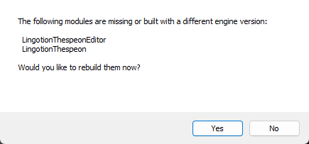
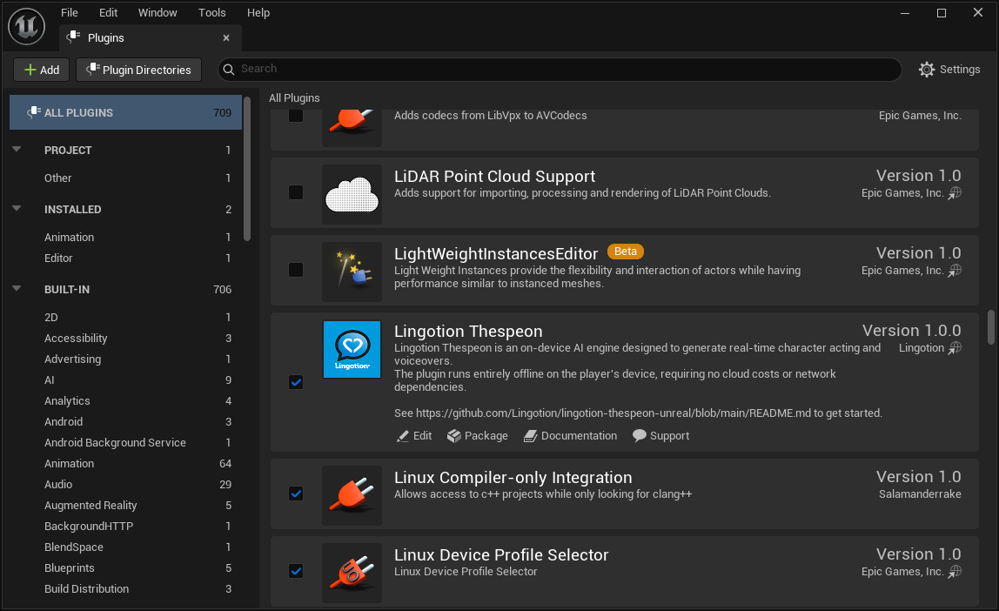
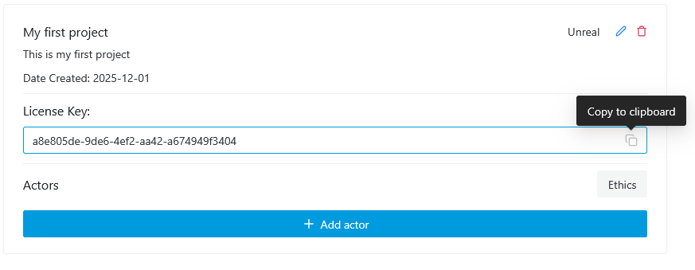
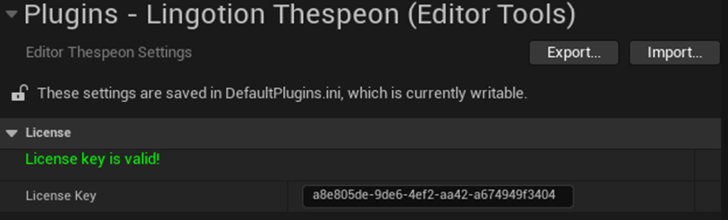
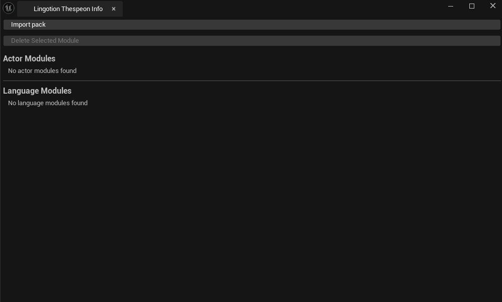
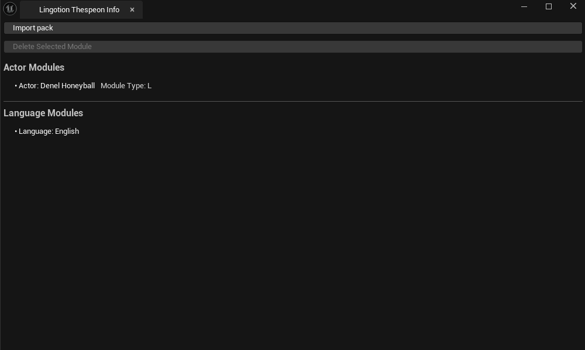

# Get Started - Unreal

## Table of Contents
- [**Overview**](#overview)
- [**Install the Thespeon Unreal Plugin**](#install-the-thespeon-unreal-plugin)
- [**Add the developer license key**](#add-the-developer-license-key)
- [**Import the downloaded _.lingotion_ file**](#import-the-downloaded-lingotion-file)
- [**Run the _GUISample_ level**](#run-the-guisample-level)
- [**Next steps**](#next-steps)

---

## Overview
This document details a step-by-step guide on how to install Lingotion Thespeon in your Unreal project, as well as how to import files downloaded from the Lingotion Developer Portal.
This process has four main steps:
1. Install the Thespeon Plugin
2. Add the developer license key
3. Import the downloaded _.lingotion_ files
4. Run the _GUISample_ level 
> [!TIP]
> If you have not downloaded any _.lingotion_ files, please follow the [Get Started - Webportal](https://github.com/Lingotion/.github/blob/main/profile/portal-docs/get-started-webportal.md) guide before proceeding.

## Install the Thespeon Unreal Plugin
> [!IMPORTANT]
> The Lingotion Thespeon Plugin only works in C++ projects. If your project is created as a Blueprint project, follow the instructions at [Unreal Engine C++ Required Setup](https://dev.epicgames.com/documentation/en-us/unreal-engine/unreal-engine-cpp-quick-start#1requiredsetup) before continuing.
> 
1. Clone the repository into the **Plugins** folder of your project, or download your desired release and extract it into the **Plugins** folder. If the folder does not exist, create it.

2. Regenerate the Visual Studio Solution files using the Tools menu, and recompile your project.

If the following popup occurs, press **Yes**:

3. When starting the project, verify that the **Lingotion Thespeon** plugin is enabled in the plugin window found in `Edit > Plugins`:

## Add the developer license key
Navigate to `Edit > Project Settings > Plugins > Lingotion Thespeon (Editor Tools)` and enter the license key from the Lingotion Developer Portal project.

> [!IMPORTANT]
> Lingotion Thespeon generates audio in 44100 Hz - please make sure that all platforms you target have their sample rate set to 44100 in the `Edit > Project Settings > Platforms > ... > Audio Mixer Sample Rate` setting. If you don't do this, the audio will sound pitched.

## Import the downloaded _.lingotion_ file
Now that the plugin is installed, we can import the _.lingotion_ file from the Lingotion developer portal.

Thespeon has its own information window that displays an overview of installed characters and languages, tools for importing and deleting modules from the project.

1. To find the _Lingotion Thespeon Info_ window, go to `Window > Lingotion Thespeon Info` from the top menu.

2. Press `Import file` and select your downloaded *.lingotion* file. If the import is successful, the character(s) and language(s) should now be visible in the window:

Now everything is set up to start using Lingotion Thespeon to generate voices!

## Run the _GUISample_ level
The quickest way to test Lingotion Thespeon is to try the GUISample Level included in the plugin. Navigate to `Content Browser > Plugins > Lingotion Thespeon > Samples > GUISample > GUISample Scene` and open the level. 

Press play, and you should see a simple UI where you can generate audio from an input text. 

> [!IMPORTANT]
> The first time each character is synthesized from will have significantly slower performance due to buffer allocations. We recommend pre-loading characters with a mock-synthesis before regular use - see how it is done in the Level Blueprint of the GUISample scene.

## Next steps

For an in-depth explanation of every feature -- character control, delegates, control characters, optimization, and more -- read **[The Thespeon Manual](./the-thespeon-manual.md)**.

The plugin also ships with several example scenes and code samples under `Content Browser > Plugins > Lingotion Thespeon > Samples`. These samples are the primary implementation reference:

- **GUISample** -- Interactive UI example demonstrating the `UThespeonComponent`, including character preloading. Check the Level Blueprint for details.
- **MinimalCharacterSample** -- Blueprint-based guide on basic use of Thespeon, found in the Level Blueprint.
- **MinimalActorExample** -- C++ Actor-based guide on basic use of Thespeon. Under Plugins > Lingotion Thespeon C++ Classes you will find the ready-made actor class SimpleThespeonActor which can be dropped into a level.
- **AngelDevilDemoActor** -- Advanced C++ Actor demonstrating multi-character concurrent synthesis with different emotions. Drop it into any level from Plugins > Lingotion Thespeon C++ Classes to try it out.
